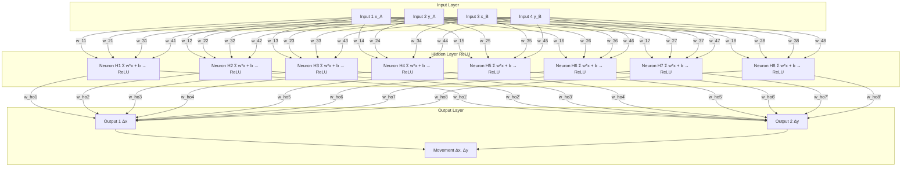

# Zig Neural Network Demo (Public Preview)

> **Status:** Public demo
> The **full repository** (modules, history, experiments, renderers) is available **on request**.

## ✨ What this is

A minimal, **from‑scratch** feed‑forward neural network in **Zig** that shows:

* **Fundamentals** — manual forward pass + backprop (SGD)
* **Performance** — cache‑friendly loops, no hidden allocations
* **Portability** — Linux/macOS/Windows; edge‑device friendly

Built on the same NN core I use for **probabilistic motion prediction** and **telco‑style user state classification**.

---

## 🧭 Why Zig

* **Low‑level control:** deterministic memory, predictable performance
* **Transparency:** every float, loop, and branch is visible
* **Production‑lean:** small binaries, no heavyweight ML deps

For Dataclair, this demonstrates **first‑principles AI engineering**, hot‑loop optimization, and clean integration points to Python/CSV/IPC when needed.

---

## 🧱 Core features

* Fully manual NN: weights, biases, forward, backprop (SGD), ReLU hidden layer
* Binary weight **save/load** (`weights.bin`)
* Clean modular code, ready to extend (CSV adapters, Vulkan visualizer, batching)

---

## 🧠 Network topology


---

## 🧩 Code snippets (from this repo)

### 1) Save/Load compact binary weights

```zig
// src/nn/base.zig  — save()
pub fn save(self: *NeuralNetwork, path: []const u8) !void {
    const file = try std.fs.cwd().createFile(path, .{});
    const writer = file.writer();
    try writer.writeAll(std.mem.asBytes(&self.weights_ih));
    try writer.writeAll(std.mem.asBytes(&self.weights_ho));
    try writer.writeAll(std.mem.asBytes(&self.bias_h));
    try writer.writeAll(std.mem.asBytes(&self.bias_o));
}

// src/nn/base.zig  — load()
pub fn load(path: []const u8) !NeuralNetwork {
    const file = try std.fs.cwd().openFile(path, .{});
    const reader = file.reader();

    var nn = NeuralNetwork{
        .weights_ih = undefined,
        .weights_ho = undefined,
        .bias_h = undefined,
        .bias_o = undefined,
    };

    try reader.readNoEof(std.mem.asBytes(&nn.weights_ih));
    try reader.readNoEof(std.mem.asBytes(&nn.weights_ho));
    try reader.readNoEof(std.mem.asBytes(&nn.bias_h));
    try reader.readNoEof(std.mem.asBytes(&nn.bias_o));

    return nn;
}
```

### 2) Initialization with explicit randomness (excerpt)

```zig
// src/nn/base.zig — init() excerpt
pub fn init() !NeuralNetwork {
    const range: f32 = 0.1;
    var nn = NeuralNetwork{
        .weights_ih = undefined,
        .weights_ho = undefined,
        .bias_h = undefined,
        .bias_o = undefined,
    };

    // Input → Hidden
    for (0..HiddenSize) |h| {
        for (0..InputSize) |i| {
            var r: u32 = 0;
            std.crypto.random.bytes(std.mem.asBytes(&r));
            nn.weights_ih[h][i] = @as(f32, @floatFromInt(r % 100)) / 100.0 - range;
        }
    }

    // Hidden → Output
    for (0..OutputSize) |o| {
        for (0..HiddenSize) |h| {
            var r: u32 = 0;
            std.crypto.random.bytes(std.mem.asBytes(&r));
            nn.weights_ho[o][h] = @as(f32, @floatFromInt(r % 100)) / 100.0 - range;
        }
    }

    // Biases
    for (0..HiddenSize) |h| {
        var r: u32 = 0;
        std.crypto.random.bytes(std.mem.asBytes(&r));
        nn.bias_h[h] = @as(f32, @floatFromInt(r % 100)) / 100.0 - range;
    }
    for (0..OutputSize) |o| {
        var r: u32 = 0;
        std.crypto.random.bytes(std.mem.asBytes(&r));
        nn.bias_o[o] = @as(f32, @floatFromInt(r % 100)) / 100.0 - range;
    }
    return nn;
}
```

### 3) Forward pass + ReLU (excerpt)

```zig
// src/nn/base.zig — forward path (excerpt)
var hidden: [HiddenSize]f32 = undefined;
var output: [OutputSize]f32 = undefined;

// Hidden layer (ReLU)
for (0..HiddenSize) |h| {
    var sum: f32 = self.bias_h[h];
    for (0..InputSize) |i| {
        sum += self.weights_ih[h][i] * input[i];
    }
    hidden[h] = if (sum > 0) sum else 0; // ReLU
}

// Output layer (linear)
for (0..OutputSize) |o| {
    var sum: f32 = self.bias_o[o];
    for (0..HiddenSize) |h| {
        sum += self.weights_ho[o][h] * hidden[h];
    }
    output[o] = sum; // (Softmax/Sigmoid can be applied by the caller if needed)
}
```

> More code (training loop, gradient updates) is in `src/nn/base.zig`. The full repo includes a live GLFW visualizer.

---

## 🔌 Interop & data

* **Binary weights** via `save()` / `load()`
* **CSV adapters + metrics** (planned MR)
* Optional **Python bridge** for dataset prep (Pandas → normalized CSV)

---

## 📈 Roadmap / Planned MRs

* He/Xavier init (seeded `DefaultPrng`)
* L2 weight decay (bias‑free)
* Early stopping + LR decay
* Dropout (training‑only)
* CSV loader + tiny metrics
* Reproducible example dataset

---

## 📬 Contact & full repo

* Public demo: this repository
* Full version: available **on request**
* **Zbyněk Másler** — [zbynekmasler@gmail.com](mailto:zbynekmasler@gmail.com)

---

## 📝 License

MIT (final license confirmed in the full repo)
